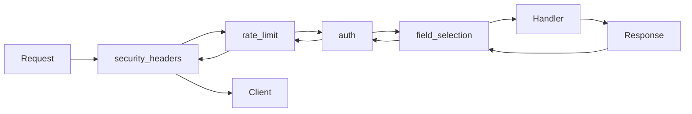

# Middleware

Apply authentication, rate limits, security headers, caching, metrics, tracing, field selection and custom policies via a high‑performance pipeline.

## Overview

Glueful’s middleware system centers on the native `Glueful\Routing\RouteMiddleware` interface while providing a bridge for PSR‑15 compatibility. It supports:

* String aliases resolved through the container (recommended default)
* Direct class / instance injection for custom configuration
* Parameter passing: `rate_limit:60,60,user`
* Group, nested group, and route‑level middleware stacking
* Global application of middleware via a wrapping group
* Interop with PSR‑15 via an adapter factory

> Tip: Prefer aliases for 90% of use cases; reach for direct instantiation only when you need divergent configuration on a small subset of routes.

## Contract

```php
interface RouteMiddleware
{
	public function handle(Request $request, callable $next, mixed ...$params): mixed;
}
```

Return either a `Glueful\Http\Response` (preferred helper) or any serializable value (arrays / DTOs) that the framework will normalize.

## Pipeline Execution

1. Request enters first middleware in declared order
2. Each middleware may mutate the request, short‑circuit with a response, or call `$next($request)`
3. Controller executes once all middleware have passed
4. Response unwinds back through middleware (post‑processing)



## Applying Middleware

### Route‑Level

```php
$router->get('/profile', [ProfileController::class, 'show'])
	->middleware('auth');

$router->post('/upload', [UploadController::class, 'store'])
	->middleware(['auth', 'csrf', 'rate_limit:10,60']);
```

### Group & Nested Groups

```php
$router->group(['middleware' => ['auth']], function($router) {
	$router->get('/dashboard', [DashboardController::class, 'index']);

	$router->group(['prefix' => '/admin', 'middleware' => ['admin_permission']], function($router) {
		$router->get('/users', [AdminController::class, 'users']);
	});
});
```

### Global Wrapper

Wrap route registration in a higher‑level group (e.g. `bootstrap/app.php`):

```php
$router->group(['middleware' => ['security_headers', 'metrics']], function($router) {
	require __DIR__.'/../routes/api.php';
});
```

## Built‑In Aliases (Examples)

| Alias | Purpose | Parameter Pattern |
|-------|---------|-------------------|
| `auth` | Authentication providers | `auth[:provider1,provider2]` |
| `rate_limit` | Distributed throttling | `rate_limit:max,window[,type]` |
| `csrf` | CSRF protection | `csrf` |
| `security_headers` | Set security/CORS headers | `security_headers[:mode]` |
| `metrics` | Collect request metrics | `metrics` |
| `tracing` | Distributed tracing spans | `tracing` |
| `field_selection` | GraphQL‑style projection | `field_selection` |
| `request_logging` | Structured request/response logs | `request_logging[:level]` |
| `admin_permission` | Admin privilege check | `admin_permission` |

> Note: Aliases are registered in core service providers—consult the container registration if you need to override or extend defaults.

## Parameterised Middleware

Parameters are appended after a colon and split on commas.

```php
$router->get('/search', [SearchController::class, 'query'])
	->middleware('rate_limit:100,60,ip');
```

Inside `handle()` retrieve them via variadics:

```php
class RateLimitMiddleware implements RouteMiddleware
{
	public function handle(Request $request, callable $next, mixed ...$params): mixed
	{
		[$max, $window, $type] = [
			(int)($params[0] ?? 60),
			(int)($params[1] ?? 60),
			(string)($params[2] ?? 'ip')
		];
		// ... logic ...
		return $next($request);
	}
}
```

> Warning: Treat all parameters as untrusted input—validate type & range before using them (especially for cache TTLs or timeouts).

## Choosing Aliases vs Instances

Use string alias when:
* Default configuration suffices
* You want consistent behavior across many endpoints
* Readability of route files matters

Instantiate directly when:
* Per‑route divergence is required
* You need environment or tenant specific behavior
* You perform A/B or feature flag experimentation

```php
$customAuth = new AuthMiddleware(providerNames: ['jwt'], options: [
	'validate_expiration' => true,
	'enable_events' => false,
]);

$router->group(['middleware' => [$customAuth]], function($router) {
	$router->get('/experimental', [ExperimentController::class, 'index']);
});
```

> Tip: Keep custom instantiated middleware localized; overuse leads to configuration drift.

## Writing Middleware

### Simple Example

```php
class TimingMiddleware implements RouteMiddleware
{
	public function handle(Request $request, callable $next): mixed
	{
		$start = microtime(true);
		$response = $next($request);
		$response->headers->set('X-Response-Time', (string) round((microtime(true)-$start)*1000,2).'ms');
		return $response;
	}
}
```

### With Dependencies (DI)

```php
class AuditMiddleware implements RouteMiddleware
{
	public function __construct(private LoggerInterface $logger, private AuditService $audit) {}

	public function handle(Request $request, callable $next): mixed
	{
		$this->logger->info('Request', ['uri' => $request->getRequestUri()]);
		$response = $next($request);
		$this->audit->record([
			'route' => $request->attributes->get('_route'),
			'status' => method_exists($response,'getStatusCode') ? $response->getStatusCode() : null,
		]);
		return $response;
	}
}
```

### Conditional / Short‑Circuit

```php
class MaintenanceMiddleware implements RouteMiddleware
{
	public function __construct(private string $flagPath = '/tmp/maintenance') {}

	public function handle(Request $request, callable $next): mixed
	{
		if (file_exists($this->flagPath) && !str_starts_with($request->getPathInfo(), '/health')) {
			return Response::error('Service temporarily unavailable', Response::HTTP_SERVICE_UNAVAILABLE);
		}
		return $next($request);
	}
}
```

> Tip: Return early for fast rejection (auth/rate limiting) to minimize downstream cost.

## Ordering Strategy

Recommended order (outer → inner):

1. Security headers / CORS
2. Rate limiting / throttling
3. Authentication
4. CSRF (requires auth context for some tokens)
5. Authorization / permissions
6. Request shaping (field selection, locale)
7. Metrics / tracing / logging (so they see full context)

```php
$router->group(['middleware' => [
  'security_headers',
  'rate_limit:100,60',
  'auth',
  'csrf',
  'admin_permission',
  'field_selection',
  'metrics',
  'request_logging'
]], function($router) {
   // protected routes
});
```

> Warning: Putting logging before rate limiting can amplify log volume during abuse attacks.

## PSR‑15 Interop

Wrap existing PSR‑15 middleware using the adapter factory then register alias or pass instance:

```php
$wrapped = Psr15AdapterFactory::wrap(new CorsMiddleware());
$container->set('psr15_cors', $wrapped);
$router->group(['middleware' => ['psr15_cors']], fn($r) => /* routes */);
```

## Performance & Optimization

| Technique | Benefit | Notes |
|-----------|---------|-------|
| Early short‑circuit | Drops invalid traffic quickly | Auth / rate limit first |
| Parameter parsing once | Reduces overhead | Cache computed config per request |
| In‑memory mini cache | Avoid duplicate expensive calls | e.g. user/permissions lookup |
| Batching external calls | Fewer network round trips | Aggregate after `$next()` when possible |
| Minimal logging at scale | Lower I/O pressure | Elevate level only for anomalous responses |

> Tip: Profile with `php glueful debug:middleware --profile` to find slow stages.

## Testing Middleware

```php
class RateLimitMiddlewareTest extends TestCase
{
	public function test_blocks_after_limit(): void
	{
		$mw = new RateLimitMiddleware(maxAttempts: 1, windowSeconds: 60);
		$req = Request::create('/x','GET');
		$next = fn($r) => Response::success(['ok']);
		$mw->handle($req,$next); // first ok
		$res = $mw->handle($req,$next); // second blocked
		$this->assertEquals(Response::HTTP_TOO_MANY_REQUESTS, $res->getStatusCode());
	}
}
```

## Common Pitfalls

> Warning: Forgetting to implement `RouteMiddleware` means your class will never be invoked even if referenced.

> Note: Middleware parameters are always strings—cast/validate before arithmetic or boolean logic.

> Tip: Prefer grouping common stacks instead of repeating long arrays across individual routes.

## Troubleshooting

| Symptom | Checks | Fix |
|---------|--------|-----|
| Middleware not executing | Alias spelled correctly? Implement interface? Added after route definition? | Register alias & verify load order |
| Parameters ignored | Are you using `mixed ...$params` signature? Indexing correctly? | Adjust signature & default extraction |
| PSR‑15 adapter failing | Bridge packages installed? Factory provided? | Install bridge + ensure factories configured |
| Wrong order effects | Auth before rate limit or vice versa causing bloat? | Reorder following recommended strategy |
| High latency | Which middleware dominates profile? | Optimize or cache expensive calls |

## Next Steps

* Continue to [Requests & Responses](./3.requests-and-responses.md)
* Review [Routing](./1.routing.md) for context on parameter binding
* See Cookbook: Middleware for deeper enterprise patterns

---

**Summary:** Middleware gives you composable, testable cross‑cutting concerns—keep stacks lean, order for early rejection, and use aliases for consistency.
