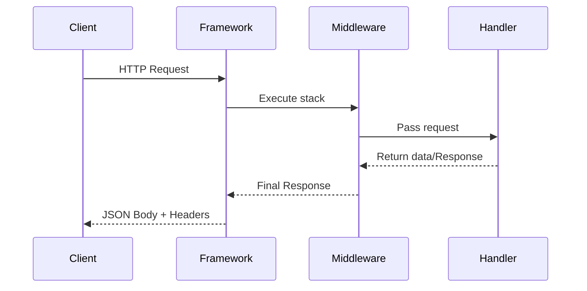

# Requests & Responses

Understand the full lifecycle: how Glueful converts an incoming HTTP request into a normalized controller context and produces consistent JSON responses (success, pagination, validation, errors, streaming, downloads, CORS, caching).

## Lifecycle Overview

1. Symfony HttpFoundation creates a `Request`
2. Router matches path & method, attaches route attributes / parameters
3. Middleware pipeline mutates or short‑circuits
4. Controller/action executes (DI provided dependencies)
5. Returned value normalized to a `Glueful\Http\Response` (JSON by default)
6. Post‑middleware modifications
7. Response encoding + headers sent



## Accessing the Request

Controllers receive dependencies via constructor or method injection. You can always retrieve the current request via helper or type‑hint it in the method signature (attribute/routed controllers) if supported.

```php
use Symfony\Component\HttpFoundation\Request;

class ProfileController
{
	public function show(Request $request): Response
	{
		$userId = $request->attributes->get('user_id');
		return Response::success(['id' => $userId]);
	}
}
```

### Common Request Operations

| Task | Example |
|------|---------|
| Query param | `$request->query->get('q')` |
| JSON body | `json_decode($request->getContent(), true)` (cache yourself) |
| Header | `$request->headers->get('Authorization')` |
| Route param | `$request->attributes->get('id')` |
| Uploaded file | `$request->files->get('avatar')` |
| Client IP | `$request->getClientIp()` |
| Method | `$request->getMethod()` |

> Tip: If you read the raw body multiple times, buffer it once then reuse the decoded result to avoid repeated parsing cost.

## Response Helper

Glueful supplies `Glueful\Http\Response`, a convenience subclass of `JsonResponse`, with factory helpers providing a consistent envelope.

| Helper | Shape | Status |
|--------|-------|--------|
| `Response::success($data, $message)` | `{ success: true, message, data }` | 200 |
| `Response::created($data)` | Standard success | 201 |
| `Response::paginated([...])` | Adds pagination metadata | 200 |
| `Response::noContent()` | Empty body | 204 |
| `Response::error(msg, status, details?)` | `{ success:false, message, error: { code,timestamp,request_id,details? }}` | variable |
| `Response::validation(errors)` | HTTP 422 validation error | 422 |
| `Response::notFound()` | Not found error | 404 |
| `Response::unauthorized()` | Auth error | 401 |
| `Response::forbidden()` | Forbidden error | 403 |
| `Response::rateLimited()` | Rate limit exceeded | 429 |
| `Response::serverError()` | Internal error | 500 |
| `Response::successWithMeta(data, meta)` | Flattens meta keys at root | 200 |

### Basic Usage

```php
class TaskController
{
	public function index(): Response
	{
		$tasks = $this->tasks->list();
		return Response::success($tasks, 'Tasks loaded');
	}

	public function store(): Response
	{
		$task = $this->tasks->create($_POST);
		return Response::created($task, 'Task created');
	}
}
```

### Automatic Serialization

If a `Serializer` is configured via `Response::setSerializer()`, passing a `SerializationContext` lets you normalize domain objects without manual transformation.

```php
$context = SerializationContext::create(['groups' => ['public']]);
return Response::success($entity, 'Loaded', $context);
```

> Note: Omit a context or pass raw arrays for maximal throughput on hot paths.

## Pagination

```php
$items = $repo->page($page, $perPage);
$total = $repo->count();
return Response::paginated($items, $total, $page, $perPage);
```

Results include: `current_page`, `per_page`, `total`, `total_pages`, `has_next_page`, `has_previous_page`.

> Tip: Keep `per_page` capped (e.g. 100) to prevent accidental large scans.

## Error Responses

Error helpers embed a unique `request_id` (when available) for correlation.

```php
try {
	$user = $this->service->find($id) ?? throw new NotFoundException();
	return Response::success($user);
} catch (NotFoundException $e) {
	return Response::notFound('User not found');
}
```

Custom details:

```php
return Response::error('Quota exceeded', Response::HTTP_FORBIDDEN, [
  'plan' => 'free',
  'limit' => 10000,
  'current' => 10000
]);
```

### Validation

```php
if (!$validator->validate($rules)) {
	return Response::validation($validator->getErrors());
}
```

### Consistency Principle

All failure payloads:

```json
{
  "success": false,
  "message": "...",
  "error": { "code": 422, "timestamp": "...", "request_id": "...", "details": { ... } }
}
```

> Warning: Don’t mix multiple top‑level keys like `errors` and `error`—choose one canonical structure (Glueful uses `error`).

## Field Selection Integration

If the `field_selection` middleware runs, projected fields are applied before serialization. Controllers should still return full objects—projection is a transport concern.

> Tip: Avoid performing manual array slicing in controllers; rely on the middleware for consistency & central performance tuning.

## Headers & Caching

Use helper chain methods:

```php
return Response::success($payload)
	->withCacheHeaders(300)
	->withETag($etagHash);
```

> Note: For conditional requests (If‑None‑Match) integrate an early middleware that checks ETag before controller execution for maximal savings.

## CORS

Security/CORS headers are typically handled by `security_headers` middleware; you can append or adjust via `withCors()` if needed for ad‑hoc endpoints:

```php
return Response::success(['public' => true])
	->withCors(['https://example.com'], ['GET'], ['Content-Type']);
```

## File Downloads

```php
return Response::success(['export' => 'ready'])
	->asDownload('report.json', 'application/json');
```

> Warning: Large binary/file streaming should bypass JSON wrapper—use Symfony StreamedResponse directly for multi‑MB payloads.

## Streaming

For large exports or server‑sent events, return a `StreamedResponse` from the controller; middleware still executes around it. Keep chunk size moderate and flush output buffers.

## Content Negotiation (Lightweight)

Glueful optimizes for JSON; if you need alternate formats (CSV/XML) implement a terminal middleware or specialized controller branch using Accept headers. Keep error format stable or clearly documented when deviating.

## Attaching Metadata

Use `successWithMeta()` to flatten meta keys:

```php
return Response::successWithMeta($rows, [
  'query_time_ms' => 12.4,
  'cached' => true
]);
```

> Tip: Flattening avoids nested `meta` objects, simplifying client selectors and caching rules.

## Common Pitfalls

> Warning: Returning raw Eloquent/ORM entities without serialization context may leak internal attributes—define serialization groups or map manually.

> Tip: Always include a human‑readable `message` even on success; it aids logging dashboards and support tooling.

> Note: Validation errors should use `Response::validation()` to ensure status 422 (not generic 400) for accurate client retries.

## Troubleshooting

| Issue | Cause | Resolution |
|-------|-------|------------|
| Missing `request_id` | Helper function not available early | Ensure bootstrap sets request correlation id |
| Double JSON encoding | Passing JSON string to `Response::success()` | Pass decoded array, not pre‑encoded JSON |
| Incorrect status code | Using `success()` for creation | Use `created()` or set explicit status |
| Pagination fields absent | Used `success()` instead of `paginated()` | Replace with pagination helper |
| Large memory usage | Loading huge collections fully | Implement cursor/stream or paginate |

## Next Steps

* Review [Middleware](./2.middleware.md) for shaping requests pre‑controller
* Explore Error Handling cookbook for advanced exception mapping
* Continue to upcoming guides (Validation, File Uploads, Caching)

---

**Summary:** Return domain results; let the Response helper enforce consistent envelopes, leverage pagination & error helpers, and centralize projection, caching & CORS in middleware for cleaner controllers.
