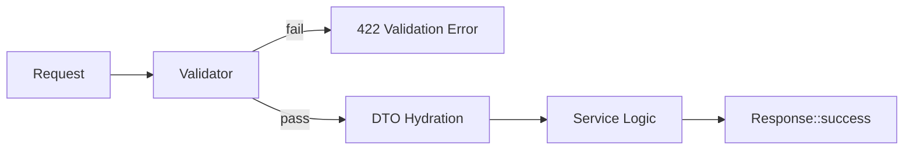

# Validation & DTOs

Design predictable APIs by validating user input early and mapping sanitized data into explicit Data Transfer Objects (DTOs) before business logic executes.

> Note: The current framework repository snapshot does not yet expose a dedicated validation component under `src/Validation/`. This guide documents the intended patterns (based on cookbook conventions and error response shapes) so you can build ahead of the stabilised module. Where implementation details may evolve, they are marked as “Assumption”.

## Goals

| Concern | Goal |
|---------|------|
| Input safety | Reject malformed / unsafe payloads deterministically |
| Developer ergonomics | Concise rule definitions & reusable custom constraints |
| Error consistency | Uniform JSON error envelope (`success:false`, `message`, `error.details`) |
| Separation | Keep controllers slim; DTOs aggregate validated shape |
| Observability | Emit structured validation failure events/metrics |

## Validation Flow

1. Raw HTTP request arrives
2. (Optional) Pre‑normalization middleware (e.g. trimming, JSON body decoding)
3. Validator runs rule set against extracted data
4. On failure: short‑circuit with `Response::validation([...])` (HTTP 422)
5. On success: Hydrate DTO (typed object) from validated payload
6. Pass DTO to service / domain layer



## Defining Rules (Assumption)

Rules likely follow a pipe or array syntax similar to other ecosystems:

```php
$rules = [
	'username' => 'required|string|min:3|max:32',
	'email'    => 'required|email',
	'age'      => 'nullable|integer|min:13',
	'roles'    => 'array|min:1',
	'roles.*'  => 'string|in:user,admin,editor'
];

if (!$validator->validate($rules)) {
		return Response::validation($validator->getErrors());
}
```

### Error Structure Example

```json
{
	"success": false,
	"message": "Validation failed",
	"error": {
		"code": 422,
		"timestamp": "2025-09-25T10:40:00Z",
		"request_id": "req_ab12cd34",
		"details": {
			"username": ["The username field is required."],
			"email": ["The email must be a valid address."]
		}
	}
}
```

> Tip: Always aggregate multiple field errors; do not abort on first failure—clients can correct all at once.

## Custom Rules (Assumption)

Implement a rule interface for clarity:

```php
interface ValidationRule {
	public function passes(string $field, mixed $value, array $data): bool;
	public function message(string $field): string;
}

class PasswordStrength implements ValidationRule {
	public function passes(string $field, mixed $value, array $data): bool {
		return is_string($value)
			&& preg_match('/[A-Z]/',$value)
			&& preg_match('/[a-z]/',$value)
			&& preg_match('/\d/',$value)
			&& strlen($value) >= 12;
	}
	public function message(string $field): string { return 'Password must be 12+ chars with upper, lower & digit.'; }
}
```

Register via container or static registry so you can reference with shorthand: `password_strength`.

> Warning: Avoid embedding database calls directly inside rules; hydrate all data needed for complex validation ahead of time and pass context.

## DTO Pattern

DTOs isolate transport from domain logic. They are immutable value objects representing validated input.

```php
final class CreateUserDto
{
	public function __construct(
		public readonly string $username,
		public readonly string $email,
		public readonly ?int $age,
		/** @var list<string> */ public readonly array $roles = ['user']
	) {}

	public static function fromArray(array $data): self
	{
		return new self(
			username: $data['username'],
			email: $data['email'],
			age: $data['age'] ?? null,
			roles: $data['roles'] ?? ['user']
		);
	}
}
```

Controller action:

```php
$data = $validator->validated(); // Only whitelisted keys
$dto  = CreateUserDto::fromArray($data);
return Response::created($this->userService->create($dto));
```

> Tip: Keep DTO constructors simple—no side effects (database, logging). They should be cheap, pure instantiations.

## Nested & Array DTOs

For complex payloads (e.g. order with line items) hydrate nested DTOs after validation stage:

```php
final class LineItemDto { public function __construct(public string $sku, public int $qty) {} }
final class OrderDto { public function __construct(public string $customer, /** @var list<LineItemDto> */ public array $items) {} }

$items = array_map(fn($row) => new LineItemDto($row['sku'],$row['qty']), $data['items']);
$order = new OrderDto($data['customer'], $items);
```

## Normalization & Serialization

When returning DTOs directly, the Response helper will serialize arrays; for objects consider a serializer context (groups) if sensitive fields require hiding.

> Warning: Returning raw domain entities may leak internal IDs or flags—project to DTOs or normalized arrays.

## Partial Updates (PATCH)

Strategy: Define a superset rule set, then extract only provided keys.

```php
$rules = [ 'email' => 'sometimes|email', 'age' => 'sometimes|integer|min:13' ];
$validator->validate($rules, mode: 'partial');
```

DTO factory can accept sparse arrays if property defaults are defined.

## Error Handling Integration

On validation failure prefer returning via `Response::validation()` middleware or early in controller before hitting services. This keeps domain layer free of transport noise.

## Performance Considerations

| Technique | Benefit | Notes |
|-----------|---------|-------|
| Pre-trim/normalize input | Reduces repeated transform | Do once in early middleware |
| Batched regex compilation | Lower repeated overhead | Cache compiled patterns in validator singleton |
| Fail fast ordering | Skip expensive rules when basics missing | Put `required` & type rules first |
| DTO hydration after pass | Avoid constructing unused objects | Only build after all pass |
| Shared rule objects | Less allocation | Inject stateless rules as services |

> Tip: Profile heavy rule sets—often string manipulation & regex dominate; cache intermediate results where feasible.

## Common Pitfalls

> Warning: Mixing validation and persistence (e.g. saving inside a rule) creates hidden side effects—keep validation pure.

> Tip: Centralize rule definitions for shared resources (User creation) to avoid drift across endpoints.

> Note: Always return HTTP 422 (not 400) for semantic validation failures—clients rely on this distinction.

## Troubleshooting
<!-- shared protection troubleshooting partial include -->
{{ include('./_partials/troubleshooting-protection.md') }}

## Next Steps

* Continue with [CORS & CSRF](./6.cors-and-csrf.md)
* Explore [Rate Limiting](./7.rate-limiting.md)
* Review [Requests & Responses](./3.requests-and-responses.md) for error envelope details
* Plan DTO to Entity mapping inside service layer

---

**Summary:** Validate early, hydrate immutable DTOs, keep rules pure and deterministic, and present consistent 422 error envelopes for excellent client ergonomics.
