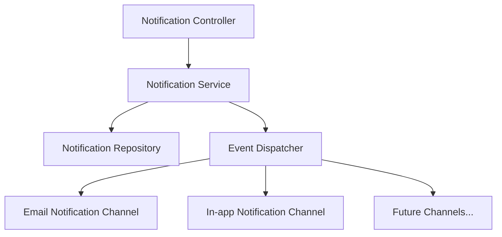

Glueful provides a robust, multi-channel notification system for sending notifications to your users through various delivery methods.

## Overview

The notification system, introduced in v0.19.0, provides a comprehensive solution for managing user notifications across multiple channels. The system supports:

- In-app notifications (stored in database)
- Email notifications (via the Email Notification extension)
- Custom notification channels (via extensions)
- Scheduled and retry-based delivery mechanisms
- Read/unread status tracking
- JSON-based payload for flexible notification data

## Architecture

The notification system follows a modular architecture with the following components:



This architecture allows for:
- Separation of notification delivery logic from application code
- Easy addition of new notification channels through extensions
- Centralized notification tracking and management
- Event-based extension points for custom behavior

## Core Components

### Notification Service

The central service that manages the entire notification lifecycle:

```php
// Sending a notification
$notificationService->send(
    'account_verification',    // notification type
    $user,                     // notifiable entity
    'Verify Your Account',     // subject
    [                          // additional data
        'verification_url' => $url,
        'expiry_minutes' => 30
    ],
    [                          // options
        'channels' => ['email', 'database'],
        'priority' => 'high'
    ]
);

// Retrieving notifications
$notifications = $notificationService->getNotifications($user, true); // true = only unread

// Mark as read
$notificationService->markAsRead($notification);

// Mark all as read
$notificationService->markAllAsRead($user);

// Scheduling a notification for future delivery
$notificationService->send(
    'payment_reminder',
    $user,
    'Payment Due Soon',
    ['invoice_id' => '123', 'amount' => '$99.99'],
    ['schedule' => new DateTime('+2 days')]
);
```

### NotificationDispatcher

Handles sending notifications through appropriate channels and manages notification events:

```php
// The dispatcher is usually used internally by the NotificationService
$dispatcher = new NotificationDispatcher($channelManager);
$result = $dispatcher->send($notification, $notifiable, ['email', 'database']);

// Result contains detailed status information
if ($result['status'] === 'success') {
    // Notification was sent successfully through at least one channel
    $successCount = $result['sent_count'];
    $totalChannels = $result['total_channels'];
    
    // Channel-specific results
    $channelResults = $result['channels'];
}
```

### ChannelManager

Registers and manages notification channels:

```php
$channelManager = new ChannelManager();
$channelManager->registerChannel(new EmailChannel());
$channelManager->registerChannel(new DatabaseChannel());

// Check if a specific channel is available
if ($channelManager->hasChannel('email')) {
    // Email channel is registered
}

// Get all available channels
$availableChannels = $channelManager->getAvailableChannels();
```

### Notification Repository

Handles persistence of notifications, preferences, and templates:

```php
$repository = new NotificationRepository();

// Find notifications for a user
$notifications = $repository->findByNotifiable('user', $userUuid);

// Find unread notifications
$unread = $repository->findByNotifiable('user', $userUuid, ['read' => false]);

// Save notification preferences
$repository->savePreference($preference);
```

## Notification Events

The system uses events to handle notification state changes throughout the lifecycle:

- `NotificationSent`: Triggered when a notification is successfully sent
- `NotificationFailed`: Triggered when notification delivery fails
- `NotificationRead`: Triggered when a user reads a notification
- `NotificationScheduled`: Triggered for notifications scheduled for future delivery
- `NotificationDelivered`: Triggered when a notification is confirmed to reach its destination
- `NotificationRetry`: Triggered when a failed notification is being retried
- `NotificationQueued`: Triggered when a notification is queued for asynchronous processing

Event listeners can be registered to handle these events:

```php
class EmailNotificationListener implements EventListener
{
    public function getSubscribedEvents(): array
    {
        return ['notification.sent', 'notification.failed'];
    }
    
    public function handle(object $event)
    {
        if ($event->getChannel() !== 'email') {
            return;
        }
        
        if ($event instanceof NotificationSent) {
            // Handle sent event
        } elseif ($event instanceof NotificationFailed) {
            // Handle failed event, possibly retry
        }
    }
}
```

## Creating Notifiable Entities

Any entity that can receive notifications must implement the `Notifiable` interface:

```php
class User implements \Glueful\Notifications\Contracts\Notifiable
{
    private string $uuid;
    private string $email;

    public function routeNotificationFor(string $channel)
    {
        if ($channel === 'email') {
            return $this->email;
        }
        return null;
    }

    public function getNotifiableId(): string
    {
        return $this->uuid;
    }

    public function getNotifiableType(): string
    {
        return 'user';
    }

    public function shouldReceiveNotification(string $notificationType, string $channel): bool
    {
        // Check user preferences or other logic
        return true;
    }

    public function getNotificationPreferences(): array
    {
        return []; // Return notification preferences
    }
}
```

## Notification Preferences

Users can set preferences for which notification types they want to receive and on which channels:

```php
// Set preference for a specific notification type
$notificationService->setPreference(
    $user,                  // notifiable entity
    'payment_reminders',    // notification type
    ['email'],              // preferred channels (null for default)
    true,                   // enabled
    ['days_before' => 3]    // additional settings
);

// Get user preferences
$preferences = $notificationService->getPreferences($user);
```

## Retry Mechanism

The notification system includes built-in retry capabilities for failed notifications:

```php
// Retry configuration in config/notifications.php
return [
    'retry' => [
        'enabled' => true,
        'max_attempts' => 3,
        'delay' => 300, // seconds
        'backoff' => 'exponential', // linear, exponential
    ],
];
```

A scheduled job handles retry processing:

```php
// This is typically set up in the config/schedule.php file
$schedule->command('notifications:process-retries', ['--limit' => 50])
    ->everyTenMinutes()
    ->description('Process queued notification retries');
```

## Notification Metrics

The system tracks performance metrics for each notification channel:

```php
// Get metrics for all channels
$metrics = $notificationService->getMetrics();

// Get metrics for a specific channel
$emailMetrics = $notificationService->getChannelMetrics('email');

// Example metrics
$successRate = $emailMetrics['success_rate']; // Percentage
$averageDeliveryTime = $emailMetrics['avg_delivery_time']; // Seconds
$totalSent = $emailMetrics['total_sent'];
$totalFailed = $emailMetrics['total_failed'];
```

## API Endpoints

The notification system exposes these endpoints:

| Method | Endpoint                                 | Description                                  |
|--------|------------------------------------------|----------------------------------------------|
| GET    | /api/notifications                       | Get all notifications for authenticated user |
| GET    | /api/notifications/unread                | Get unread notifications                     |
| GET    | /api/notifications/{uuid}                | Get a specific notification                  |
| POST   | /api/notifications/mark-read/{uuid}      | Mark a notification as read                  |
| POST   | /api/notifications/mark-all-read         | Mark all notifications as read               |
| DELETE | /api/notifications/{uuid}                | Delete a notification                        |
| GET    | /api/notifications/preferences           | Get notification preferences                 |
| POST   | /api/notifications/preferences           | Update notification preferences              |
| GET    | /api/notifications/metrics               | Get notification metrics (admin only)        |
| GET    | /api/notifications/metrics/{channel}     | Get metrics for a specific channel           |

## Configuration

Configure notification settings in `config/notifications.php`:

```php
return [
    'channels' => [
        'email' => [
            'enabled' => true,
            'driver' => 'smtp', // or 'api', 'sendgrid', etc.
            'from' => [
                'address' => 'noreply@example.com',
                'name' => 'Notification System'
            ],
            'template_path' => 'storage/templates/email',
        ],
        'database' => [
            'enabled' => true,
        ],
    ],
    'default_channel' => 'database',
    'retry' => [
        'max_attempts' => 3,
        'delay' => 300, // seconds
    ],
];
```

## Email Notification Extension

Glueful includes an email notification extension that provides robust email delivery capabilities integrated with the core notification system.

### Features

- Template-based email formatting with variable substitution
- Support for multiple mail delivery providers (SMTP, Sendgrid, Mailgun)
- HTML and plain text email support with responsive templates
- Attachment handling
- Email queuing and batch processing
- Delivery status tracking and retry mechanisms

### Installation

1. Ensure the extension is in your `extensions/EmailNotification` directory
2. Update your `config/extensions.php` file to enable the extension:

```php
return [
    // Other extensions...
    'email_notification' => [
        'provider' => \Glueful\Extensions\EmailNotification\EmailNotificationProvider::class,
        'enabled' => true,
    ],
];
```

### Configuration

Configure the extension using environment variables or in your config file:

```php
// In config/extensions.php
'email_notification' => [
    'provider' => \Glueful\Extensions\EmailNotification\EmailNotificationProvider::class,
    'enabled' => true,
    'config' => [
        'host' => env('MAIL_HOST', 'smtp.example.com'),
        'port' => env('MAIL_PORT', 587),
        'username' => env('MAIL_USERNAME', ''),
        'password' => env('MAIL_PASSWORD', ''),
        'encryption' => env('MAIL_ENCRYPTION', 'tls'),
        'from' => [
            'address' => env('MAIL_FROM_ADDRESS', 'noreply@example.com'),
            'name' => env('MAIL_FROM_NAME', 'Notification System'),
        ],
        'templates_path' => null, // Uses built-in templates by default
        'retry' => [
            'enabled' => true,
            'max_attempts' => 3,
            'delay' => 300, // seconds
        ],
        'rate_limit' => [
            'enabled' => true,
            'max_per_minute' => 10,
            'max_per_hour' => 100,
        ],
    ],
],
```

### Using Email Notifications

Once configured, you can send email notifications through the notification service:

```php
// Basic email notification
$notificationService->send(
    'account_activity',      // notification type
    $user,                   // notifiable entity
    'Your account was accessed',  // subject
    [                        // additional data
        'message' => 'Your account was accessed from a new device.',
        'location' => 'San Francisco, CA',
        'device' => 'iPhone 13',
        'time' => '2025-04-24 14:30:00'
    ],
    [                        // options
        'channels' => ['email'],
    ]
);

// Using a specific template
$notificationService->sendWithTemplate(
    'welcome',              // notification type
    $user,                  // notifiable entity
    'welcome',              // template name
    [                       // template data
        'name' => $user->getName(),
        'app_name' => 'Your Amazing App',
        'message' => 'We\'re excited to have you join our platform!',
        'action_url' => 'https://example.com/get-started',
        'action_text' => 'Get Started'
    ],
    [                       // options
        'channels' => ['email'],
    ]
);

// Advanced email options
$notificationService->send(
    'invoice',
    $user,
    'Your Invoice #123',
    [
        'message' => 'Please find your invoice attached.',
        'attachments' => [
            [
                'path' => '/path/to/invoice.pdf',
                'name' => 'Invoice-123.pdf',
                'mime' => 'application/pdf'
            ]
        ],
        'cc' => ['accounts@example.com'],
        'bcc' => ['records@example.com'],
        'priority' => 'high',
        'track_opens' => true,
        'track_clicks' => true
    ],
    [
        'channels' => ['email'],
        'provider' => 'sendgrid' // Override default provider
    ]
);
```

### Built-in Email Templates

The EmailNotification extension includes several pre-built templates:

1. **Default Template** - A general-purpose template with support for messages, CTA buttons, and verification codes
2. **Welcome Template** - Specialized for welcoming new users
3. **Verification Template** - For sending verification codes or OTPs
4. **Alert Template** - For important alerts and notifications

Example of the welcome template:

```html
{{> header}}
<div class="message">
    <p>Hello {{name}},</p>
    <p>Welcome to {{app_name}}! We're excited to have you join us.</p>
    
    {{#if message}}
    <p>{{message}}</p>
    {{/if}}
    
    {{#if action_url}}
    <div style="text-align: center; margin: 30px 0;">
        <a href="{{action_url}}" class="btn">
            {{#if action_text}}{{action_text}}{{else}}Get Started{{/if}}
        </a>
    </div>
    {{/if}}
    
    <p>If you have any questions, feel free to contact our support team.</p>
</div>
{{> footer}}
```

### Creating Custom Email Templates

You can create custom email templates by extending the `EmailFormatter` class:

```php
$formatter = new EmailFormatter();

// Register a custom template
$formatter->registerTemplate('password_reset', [
    'header' => $formatter->getTemplate('default', 'default')['header'],
    'body' => '
        <div class="message">
            <p>Hello {{name}},</p>
            <p>We received a request to reset your password.</p>
            <div style="text-align: center; margin: 30px 0;">
                <a href="{{reset_url}}" class="btn">
                    Reset Password
                </a>
            </div>
            <p>This link will expire in {{expiry}}.</p>
            <p>If you did not request a password reset, no further action is required.</p>
        </div>
    ',
    'footer' => $formatter->getTemplate('default', 'default')['footer']
]);

// Create a custom channel with the formatter
$channel = new EmailChannel([], $formatter);
```

### Troubleshooting Email Notifications

If emails are not being sent:

1. Check that the extension is enabled in your configuration
2. Verify that your SMTP credentials are correct
3. Check your server's outgoing email capabilities
4. If using Gmail, make sure you're using an App Password rather than your account password
5. Enable debug mode in the configuration to see more detailed error information

## Custom Notification Channels

Glueful's notification system can be extended with custom notification channels to deliver notifications through additional services like SMS, push notifications, Slack, or any other delivery method.

### Creating a Custom Notification Channel

A notification channel must implement the `NotificationChannel` interface, which defines the contract for all notification channels in the system.

#### Step 1: Create Your Channel Class

```php
<?php
declare(strict_types=1);

namespace YourNamespace;

use Glueful\Notifications\Contracts\Notifiable;
use Glueful\Notifications\Contracts\NotificationChannel;

class SlackNotificationChannel implements NotificationChannel
{
    /**
     * @var array Configuration options for the Slack channel
     */
    private array $config;

    /**
     * SlackNotificationChannel constructor
     *
     * @param array $config Configuration options
     */
    public function __construct(array $config = [])
    {
        $this->config = $config;
    }

    /**
     * Get the channel name.
     *
     * @return string The name of the notification channel
     */
    public function getChannelName(): string
    {
        return 'slack';
    }

    /**
     * Send the notification to the specified notifiable entity.
     *
     * @param Notifiable $notifiable The entity receiving the notification
     * @param array $data Notification data including content and metadata
     * @return bool Whether the notification was sent successfully
     */
    public function send(Notifiable $notifiable, array $data): bool
    {
        // Get the Slack webhook URL
        $webhookUrl = $notifiable->routeNotificationFor('slack') ?? $this->config['webhook_url'] ?? null;

        if (!$webhookUrl) {
            return false;
        }

        // Format the data for Slack
        $payload = $this->formatPayload($data);

        // Send to Slack using webhook
        return $this->sendToWebhook($webhookUrl, $payload);
    }

    /**
     * Format the notification data for this channel.
     *
     * @param array $data The raw notification data
     * @param Notifiable $notifiable The entity receiving the notification
     * @return array The formatted data for this channel
     */
    public function format(array $data, Notifiable $notifiable): array
    {
        // Format the notification data for Slack
        return [
            'text' => $data['subject'] ?? 'New notification',
            'blocks' => [
                [
                    'type' => 'section',
                    'text' => [
                        'type' => 'mrkdwn',
                        'text' => $data['message'] ?? $data['subject'] ?? 'No content'
                    ]
                ]
            ],
            'attachments' => $this->formatAttachments($data)
        ];
    }

    /**
     * Check if the channel is available.
     *
     * @return bool Whether the channel is available for use
     */
    public function isAvailable(): bool
    {
        // Check if the Slack integration is properly configured
        return isset($this->config['webhook_url']) || isset($this->config['api_token']);
    }

    // Private helper methods...
}
```

#### Step 2: Register Your Channel

Once you've created your channel class, you need to register it with the `ChannelManager`. The simplest way to do this is through an extension:

```php
<?php
declare(strict_types=1);

namespace YourNamespace;

use Glueful\Notifications\Contracts\NotificationExtension;
use Glueful\Notifications\Contracts\Notifiable;

class SlackNotificationExtension implements NotificationExtension
{
    /**
     * @var SlackNotificationChannel The Slack channel instance
     */
    private SlackNotificationChannel $channel;

    /**
     * @var array Configuration options
     */
    private array $config = [];

    /**
     * Get the extension name.
     *
     * @return string The name of the notification extension
     */
    public function getExtensionName(): string
    {
        return 'slack_notification';
    }

    /**
     * Initialize the extension.
     *
     * @param array $config Configuration options for the extension
     * @return bool Whether the initialization was successful
     */
    public function initialize(array $config = []): bool
    {
        $this->config = $config;
        $this->channel = new SlackNotificationChannel($config);
        return true;
    }

    /**
     * Get the notification channel provided by this extension.
     *
     * @return SlackNotificationChannel The Slack notification channel
     */
    public function getChannel(): SlackNotificationChannel
    {
        return $this->channel;
    }

    // Other required methods...
}
```

#### Step 3: Register Your Extension

Create a provider class to register your extension with the system:

```php
<?php
declare(strict_types=1);

namespace YourNamespace;

use Glueful\Helpers\ExtensionManager;

class SlackNotificationProvider
{
    public function register(ExtensionManager $extensionManager)
    {
        // Create the extension
        $extension = new SlackNotificationExtension();

        // Initialize it with configuration
        $extension->initialize([
            'webhook_url' => env('SLACK_WEBHOOK_URL'),
            'api_token' => env('SLACK_API_TOKEN'),
            'default_channel' => env('SLACK_DEFAULT_CHANNEL', '#notifications')
        ]);

        // Register the extension with the notification dispatcher
        $notificationDispatcher = $extensionManager->getNotificationDispatcher();
        $notificationDispatcher->registerExtension($extension);

        // Register the channel with the channel manager
        $channelManager = $notificationDispatcher->getChannelManager();
        $channelManager->registerChannel($extension->getChannel());
    }
}
```

#### Step 4: Configure Your Extension

Add your extension configuration to `config/extensions.php`:

```php
return [
    // Other extensions...
    'slack_notification' => [
        'provider' => \YourNamespace\SlackNotificationProvider::class,
        'enabled' => true,
        'config' => [
            'webhook_url' => env('SLACK_WEBHOOK_URL'),
            'api_token' => env('SLACK_API_TOKEN'),
            'default_channel' => env('SLACK_DEFAULT_CHANNEL', '#notifications'),
        ],
    ],
];
```

### Supporting Notification Routing

To make your channel work seamlessly with the routing system, ensure that notifiable entities can provide appropriate routing information:

```php
class User implements \Glueful\Notifications\Contracts\Notifiable
{
    // ... other Notifiable methods ...

    public function routeNotificationFor(string $channel)
    {
        if ($channel === 'slack') {
            return $this->slack_webhook_url ?? $this->slack_user_id ?? null;
        }

        // Handle other channels
        return parent::routeNotificationFor($channel);
    }
}
```

## Best Practices

1. **Type Naming**: Use descriptive, namespaced notification types (e.g., `user.welcome`, `order.shipped`)
2. **Payload Structure**: Keep the JSON data payload consistent for each notification type
3. **Templates**: Use reusable templates for notification content
4. **Localization**: Store user-facing content in localizable formats
5. **Cleanup**: Implement a retention policy to remove old notifications
6. **Error Handling**: Add robust error handling for notification delivery failures
7. **Test Channels**: Always test new notification channels in development before deploying to production
8. **User Preferences**: Respect user notification preferences and provide opt-out options
9. **Scheduled Notifications**: Use scheduled notifications for time-sensitive messages
10. **Metrics Monitoring**: Regularly check notification delivery metrics for system health
